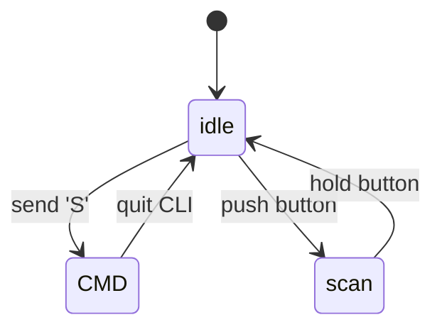

# radar

## Description

A tiny radar(just a toy!!😂) which is able to picture surrounding environment in 2D.

## Outline

### 1. Hardware lists

- Distance measurement sensor (e.g. ToF)
- Motor (e.g. step motor)
- MCU (e.g. STM32)
- magnetic rotary position sensor(e.g. AS5600)

### 2. Embedded software

- Finite state machine

The embedded software operates on a state machine framework comprising three states. Upon startup, the program enters the **idle** state, then awaits events that trigger transitions to either the **CMD** state or **scan** state.

All base units are typically tested in the **CMD** state using a **CLI** (command-line interface).

The main functionality operates in the **scan** state.

The state transition rules are illustrated in the following figure:

- Communication protocol

Here's a simple convention for data transfer. The protocol frame format is as follows:

| element           | length (bits) | brief                       |
| ----------------- | ------------- | --------------------------- |
| reserved[5:0]     | 6             | reserved band               |
| type[6:7]         | 2             | the frame type              |
| angle_H[8:15]     | 8             | the angle data high byte    |
| angle_L[16:23]    | 8             | the angle data low byte     |
| distance_H[24:31] | 8             | the distance data high byte |
| distance_L[32:39] | 8             | the distance data low byte  |

The most significant 2 bits of the first byte is used to  stand for the contained data frame type.

### 3.Upper computer software

**TO-DO**
